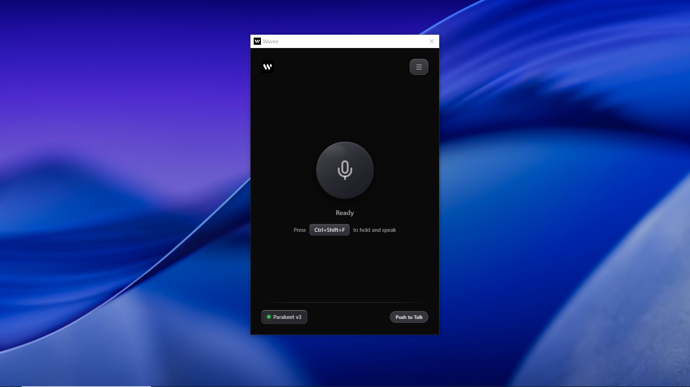

# WhisprTypr

<p align="center">
  
</p>



**Wave your voice. Get text at your cursor.**

WhisprTypr is a local-first desktop dictation app for Windows and macOS. Hold a hotkey, speak naturally, and WhisprTypr turns your voice into polished text that can be inserted right where you are working.

[Download Latest Release](https://github.com/johuniq/whisprtypr/releases/latest) · [Report A Bug](https://github.com/johuniq/whisprtypr/issues/new?template=bug_report.yml) · [Contribute](CONTRIBUTING.md)

## Why WhisprTypr

- **Voice to cursor**: dictate once and place the result into the app you are already using.
- **Local-first privacy**: core dictation stays on your device.
- **Made for real workflows**: works for writing, support, notes, messaging, docs, and technical text.
- **Smart output, not raw transcription**: text cleanup, punctuation handling, technical formatting, and voice commands make the result more usable.
- **Desktop-native flow**: global hotkeys, tray access, recording feedback, and background-ready behavior.
- **Reusable history**: find, copy, export, and manage past transcripts without repeating yourself.

## What WhisprTypr Covers

WhisprTypr is built to cover the full desktop dictation workflow from start to finish:

- Live microphone dictation
- Audio file transcription
- Global hotkeys with push-to-talk and toggle modes
- Direct cursor insertion
- Clipboard output mode
- Smart post-processing and cleanup
- Voice commands for editing and navigation
- Searchable local history
- Downloadable transcription models
- Recording indicators and desktop integration
- Local-first data handling
- Windows and macOS desktop support

## How It Works

1. **Record** with push-to-talk or toggle mode.
2. **Transcribe** speech into text with your selected local model.
3. **Clean up** the output with optional post-processing.
4. **Insert or copy** the result into your current workflow.
5. **Reuse later** through searchable local history.

## Core Features

### Voice To Cursor

WhisprTypr listens when you ask it to, turns speech into text, and places the result where your cursor is active. It is designed to feel like adding a voice lane to your existing desktop workflow, not forcing you into a separate writing environment.

### Local Transcription

WhisprTypr processes dictation locally so the core speech-to-text experience does not depend on sending your audio away. That makes it a strong fit for privacy-conscious users and teams who want more control over their workflow.

### Global Hotkeys

Use push-to-talk for quick bursts or toggle mode for longer dictation sessions. Hotkeys work across your desktop so WhisprTypr is ready even when the app is not front and center.

### Desktop Integration

WhisprTypr is built for everyday desktop use:

- System tray access
- Background-ready behavior
- Optional launch on startup
- Recording indicators and overlays for clear feedback

### Text Injection And Clipboard Mode

Choose how output lands:

- **Direct insertion** when you want text to appear at the active cursor
- **Clipboard mode** when you want to paste it yourself with more control

### Audio File Transcription

WhisprTypr is not limited to live recording. You can also transcribe saved audio files, which is useful for voice notes, meeting clips, interviews, and other recordings you already have.

### Searchable History

WhisprTypr keeps a local history of past transcripts so you can:

- Search previous text
- Copy earlier results
- Delete individual entries
- Clear history when needed
- Export and import your transcript archive

### Model Management

Different users want different tradeoffs. WhisprTypr lets you manage transcription models locally so you can choose the balance of speed, accuracy, and device fit that works best for you.

## Signature Text Processing

WhisprTypr is more than speech-to-text. One of its highest-value parts is what happens after transcription: turning rough spoken words into output that already feels clean and usable.

### 1. Sentence And Grammar Correction

WhisprTypr improves casing and readability so dictated text feels more finished.

Example:
`hello team i finished the homepage update` -> `Hello team, I finished the homepage update.`

### 2. Code-Specific Formatting

WhisprTypr helps technical phrases come out in a more useful shape for developers and technical users.

Examples:
`slash src slash components slash button dot tsx` -> `/src/components/Button.tsx`

`my class` -> `MyClass`

`function name` -> `functionName()`

### 3. Symbol And Punctuation Handling

WhisprTypr can convert spoken punctuation and symbol phrases into written output.

Example:
`hello comma world exclamation mark` -> `Hello, world!`

### 4. Whitespace Cleanup

WhisprTypr removes awkward spacing and formatting noise so the final text needs less manual fixing.

Example:
`This    is   spaced   badly` -> `This is spaced badly`

### 5. Voice Commands Processing

WhisprTypr can recognize spoken editing and navigation actions as part of your dictation workflow, helping you stay more hands-free while correcting or moving through text.

Example:
Saying `undo`, `paste`, `select all`, or `backspace word` can trigger editing behavior without reaching for the keyboard as often.

### 6. Custom Vocabulary

WhisprTypr lets you define domain-specific terms that local transcription models consistently mangle — product names, internal codenames, library names, acronyms, niche jargon — and have them replaced automatically in the final output.

Open **Settings → Custom Vocabulary** to add pairs:

- **You say**: the phrase Whisper tends to mishear (e.g. `next js`, `k eight s`, `wave e`)
- **WhisprTypr writes**: the canonical text that should appear in your output (e.g. `Next.js`, `k8s`, `WhisprTypr`)

Matching is case-insensitive and whole-word aware, so longer phrases always win over shorter substrings and replacements never fire inside unrelated words. The written form is preserved verbatim, so include the casing, punctuation, and symbols you want.

This pairs naturally with WhisprTypr's code-aware post-processing: dictating `next js slash app slash layout dot tsx` becomes `Next.js/app/@layout.tsx`, without Whisper deciding it's "next j s" along the way.

## Voice Commands

WhisprTypr supports voice-driven editing and navigation commands so dictation can do more than just insert text.

Common examples include:

- Undo and redo
- Copy, cut, and paste
- Select all
- Backspace, forward delete, and delete actions
- Delete word or delete line behavior
- Enter, tab, and escape
- Move left, right, up, and down
- Page up and page down
- Jump by word
- Move to the start or end of a line
- Extend selection left, right, up, and down
- Select by word or select to the start/end of a line

This makes WhisprTypr useful not only for writing text, but also for controlling text flow while you work.

## Who It Is For

WhisprTypr is especially useful for:

- Writers capturing ideas quickly
- Developers dictating notes, paths, commands, and technical text
- Professionals replying to messages and drafting documents
- Support and operations teams handling repetitive text entry
- Privacy-conscious users who prefer local-first tools

## Supported Platforms

WhisprTypr currently supports:

- Windows 10 (version 1803 or later) and Windows 11
- macOS 13 Ventura or later

Linux desktop builds are not currently supported.

macOS builds are produced for both Apple Silicon and Intel Macs.

Windows installers use WebView2. On Windows 10 version 1803+ and Windows 11, this is typically already available or installed automatically by the installer.

System requirements vary depending on the transcription model you choose. Larger models generally need more memory and storage.

## Getting Started

### Windows

**Install via Winget (Recommended):**
```sh
winget install Johuniq.WhisprTypr
```

**Or install manually:**
1. Download the latest Windows installer from [Releases](https://github.com/johuniq/whisprtypr/releases/latest).
2. Run the installer.
3. Open WhisprTypr.
4. Choose a transcription model during setup.
5. Grant microphone permission if Windows prompts for it.
6. Press the configured recording hotkey and speak.

### Windows Unknown Publisher Warning

WhisprTypr is not signed with a Windows code-signing certificate yet. Windows may show an "Unknown publisher" or "Windows protected your PC" warning during install or first launch.

To continue:

1. Click **More info** if Windows SmartScreen appears.
2. Click **Run anyway**.
3. Continue the installer.

You only need to do this for the unsigned installer you downloaded.

### macOS

1. Download `WhisprTypr.dmg` from [Releases](https://github.com/johuniq/whisprtypr/releases/latest).
2. Open the DMG.
3. Drag **WhisprTypr** to **Applications**.
4. Open WhisprTypr from Applications.
5. Grant **Microphone** and **Accessibility** permissions when prompted.
6. Press the configured recording hotkey and speak.

### macOS "Apple Could Not Verify" Warning

WhisprTypr is not signed with an Apple Developer ID yet. macOS may block the first launch with an "Apple could not verify" warning.

To open WhisprTypr:

1. Open **System Settings**.
2. Go to **Privacy & Security**.
3. Scroll down to the security message for WhisprTypr.
4. Click **Open Anyway**.
5. Confirm the prompt.

You only need to do this once for the downloaded app.

## Privacy

- Audio is processed locally for the core dictation experience.
- Transcript history and app data stay on your device.
- No telemetry or cloud dependency is required for the core workflow.
- Built for users who want local ownership, privacy, and control.

## Open Source

WhisprTypr is open source and community-friendly. Contributions are welcome.

Please read [CONTRIBUTING.md](CONTRIBUTING.md), [CODE_OF_CONDUCT.md](CODE_OF_CONDUCT.md), and [SECURITY.md](SECURITY.md) before opening an issue or pull request.

Please report vulnerabilities privately using the process in [SECURITY.md](SECURITY.md).

## For Developers

### Prerequisites

- Node.js LTS
- pnpm
- Rust stable, minimum Rust 1.81
- Platform dependencies required by Tauri

### Run Locally

```sh
pnpm install
pnpm tauri:dev
```

### Build

```sh
pnpm build
pnpm tauri:build
```

### Test

```sh
pnpm run typecheck
cd src-tauri
cargo test -j 1
```

`-j 1` is recommended on Windows development machines with limited paging-file space because large native build artifacts can use significant memory.

## Repository Layout

```text
src/                 React frontend
src-tauri/           Rust/Tauri backend
src-tauri/tests/     Backend integration and E2E tests
scripts/             Release and maintenance scripts
public/              Static frontend assets
.github/             CI, issue templates, and release workflow
```

## License

WhisprTypr is released under the [GNU Affero General Public License v3.0](LICENSE).

This repository includes vendored third-party code under `src-tauri/vendor/`. Those components keep their own upstream license files where provided.
